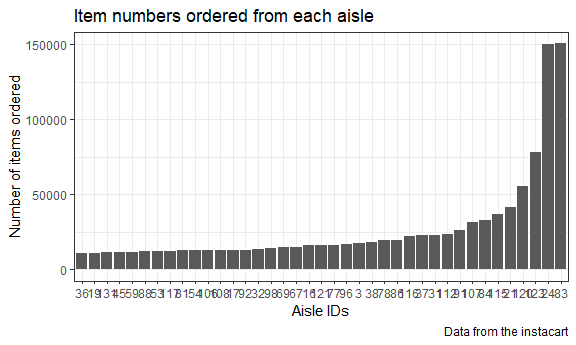
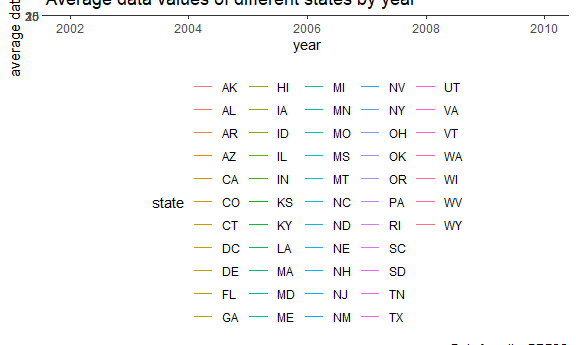
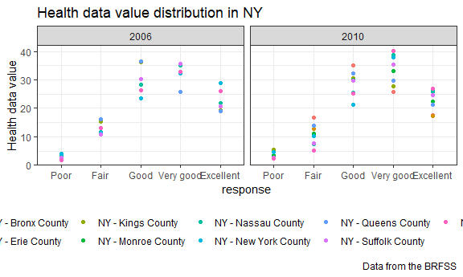

P8105 Homework 3 Solution
================
Xun Wang
10/14/2019

This file is the solution to P8105 Homework 3 from Xun Wang (xw2417).

Besides loading `library` in the beginning, I also include figure
preferences in global options as this code chunk.

``` r
library(tidyverse)
library()

knitr::opts_chunk$set(
  echo = TRUE，
  fig.width = 6,
  fig.asp = .6,
  out.width = "90%")

theme_set(theme_bw() + theme(legend.position = "bottom"))
```

## Problem 1

This problem uses the *Instacart* dataset.

#### 1.1 Read datasets from Github

The code chunk below reads the dataset *instacart* from Github package
*p8105.datasets*.

``` r
library(p8105.datasets)
data("instacart")
instacart = janitor::clean_names(instacart)
```

**Comments:** The *instacart* dataset read from Github is cleaned by
`janitor::clean_names`. The *instacart* dataset has 1384617 rows and 15
columns. The **key** variables are the *order\_id* and *product\_id*.
For example, in order 1 ordered by user 112108, Bulgarian Yogurt
(product 49302) was the first to be added to the cart. This was the 4th
time the user placed an order and this product was reordered by the
user. The order was placed on Thursday between 10-11 am, 9 days after
the user’s last purchase. This product was placed at *yogurt* aisle
(aisle\_id 120) in the *dairy & eggs* department (department\_id
16).

#### 1.2 *instacart* data analysis

###### 1.2.1 Analysis 1: How many aisles are there, and which aisles are the most items ordered from?

``` r
aisle_summary = 
  instacart %>%
  group_by(aisle, aisle_id) %>%
  summarize(n = n()) %>% 
  arrange(n)
```

**Comments:** There are **134 aisles** and most items ordered are from
aisle **fresh vegetables** with aisle id
**83**.

###### 1.2.2 Analysis 2: Make a plot that shows the number of items ordered in each aisle, limiting this to aisles with more than 10,000 items ordered. Arrange aisles sensibly, and organize your plot so others can read it.

``` r
aisle_summary %>% 
  filter(n > 10000) %>% 
  mutate(
    aisle_id = as.character(aisle_id)) %>% 
  ggplot(mapping = aes(x = reorder(aisle_id, n), y = n)) + 
  geom_bar(stat = "identity") +
  labs(
    title = "Item numbers ordered from each aisle",
    x = "Aisle IDs",
    y = "Number of items ordered",
    caption = "Data from the instacart"
  )
```



**Comments:** The bar graph above shows the number of items ordered from
each aisle. It only shows aisles with more than 10,000 items ordered. I
sequence the bars by an ascending order of the number of items ordered.
Because there is not enough space using real names of the aisle as the x
aixs, I use *Aisle IDs* as the x axis. You can find a table showing
“Aisle IDs” and “Aisle Names” below.

<table>

<caption>

Table 1: Aisle IDs vs. Aisle Names

</caption>

<thead>

<tr>

<th style="text-align:right;">

aisle\_id

</th>

<th style="text-align:left;">

aisle

</th>

</tr>

</thead>

<tbody>

<tr>

<td style="text-align:right;">

36

</td>

<td style="text-align:left;">

butter

</td>

</tr>

<tr>

<td style="text-align:right;">

19

</td>

<td style="text-align:left;">

oils vinegars

</td>

</tr>

<tr>

<td style="text-align:right;">

131

</td>

<td style="text-align:left;">

dry pasta

</td>

</tr>

<tr>

<td style="text-align:right;">

45

</td>

<td style="text-align:left;">

candy chocolate

</td>

</tr>

<tr>

<td style="text-align:right;">

59

</td>

<td style="text-align:left;">

canned meals beans

</td>

</tr>

<tr>

<td style="text-align:right;">

88

</td>

<td style="text-align:left;">

spreads

</td>

</tr>

<tr>

<td style="text-align:right;">

53

</td>

<td style="text-align:left;">

cream

</td>

</tr>

<tr>

<td style="text-align:right;">

117

</td>

<td style="text-align:left;">

nuts seeds dried fruit

</td>

</tr>

<tr>

<td style="text-align:right;">

81

</td>

<td style="text-align:left;">

canned jarred vegetables

</td>

</tr>

<tr>

<td style="text-align:right;">

54

</td>

<td style="text-align:left;">

paper goods

</td>

</tr>

<tr>

<td style="text-align:right;">

106

</td>

<td style="text-align:left;">

hot dogs bacon sausage

</td>

</tr>

<tr>

<td style="text-align:right;">

108

</td>

<td style="text-align:left;">

other creams cheeses

</td>

</tr>

<tr>

<td style="text-align:right;">

17

</td>

<td style="text-align:left;">

baking ingredients

</td>

</tr>

<tr>

<td style="text-align:right;">

92

</td>

<td style="text-align:left;">

baby food formula

</td>

</tr>

<tr>

<td style="text-align:right;">

32

</td>

<td style="text-align:left;">

packaged produce

</td>

</tr>

<tr>

<td style="text-align:right;">

98

</td>

<td style="text-align:left;">

juice nectars

</td>

</tr>

<tr>

<td style="text-align:right;">

69

</td>

<td style="text-align:left;">

soup broth bouillon

</td>

</tr>

<tr>

<td style="text-align:right;">

67

</td>

<td style="text-align:left;">

fresh dips tapenades

</td>

</tr>

<tr>

<td style="text-align:right;">

16

</td>

<td style="text-align:left;">

fresh herbs

</td>

</tr>

<tr>

<td style="text-align:right;">

121

</td>

<td style="text-align:left;">

cereal

</td>

</tr>

<tr>

<td style="text-align:right;">

77

</td>

<td style="text-align:left;">

soft drinks

</td>

</tr>

<tr>

<td style="text-align:right;">

96

</td>

<td style="text-align:left;">

lunch meat

</td>

</tr>

<tr>

<td style="text-align:right;">

3

</td>

<td style="text-align:left;">

energy granola bars

</td>

</tr>

<tr>

<td style="text-align:right;">

38

</td>

<td style="text-align:left;">

frozen meals

</td>

</tr>

<tr>

<td style="text-align:right;">

78

</td>

<td style="text-align:left;">

crackers

</td>

</tr>

<tr>

<td style="text-align:right;">

86

</td>

<td style="text-align:left;">

eggs

</td>

</tr>

<tr>

<td style="text-align:right;">

116

</td>

<td style="text-align:left;">

frozen produce

</td>

</tr>

<tr>

<td style="text-align:right;">

37

</td>

<td style="text-align:left;">

ice cream ice

</td>

</tr>

<tr>

<td style="text-align:right;">

31

</td>

<td style="text-align:left;">

refrigerated

</td>

</tr>

<tr>

<td style="text-align:right;">

112

</td>

<td style="text-align:left;">

bread

</td>

</tr>

<tr>

<td style="text-align:right;">

91

</td>

<td style="text-align:left;">

soy lactosefree

</td>

</tr>

<tr>

<td style="text-align:right;">

107

</td>

<td style="text-align:left;">

chips pretzels

</td>

</tr>

<tr>

<td style="text-align:right;">

84

</td>

<td style="text-align:left;">

milk

</td>

</tr>

<tr>

<td style="text-align:right;">

115

</td>

<td style="text-align:left;">

water seltzer sparkling water

</td>

</tr>

<tr>

<td style="text-align:right;">

21

</td>

<td style="text-align:left;">

packaged cheese

</td>

</tr>

<tr>

<td style="text-align:right;">

120

</td>

<td style="text-align:left;">

yogurt

</td>

</tr>

<tr>

<td style="text-align:right;">

123

</td>

<td style="text-align:left;">

packaged vegetables fruits

</td>

</tr>

<tr>

<td style="text-align:right;">

24

</td>

<td style="text-align:left;">

fresh fruits

</td>

</tr>

<tr>

<td style="text-align:right;">

83

</td>

<td style="text-align:left;">

fresh
vegetables

</td>

</tr>

</tbody>

</table>

###### 1.2.3 Analysis 3: Make a table showing the three most popular items in each of the aisles “baking ingredients”, “dog food care”, and “packaged vegetables fruits”. Include the number of times each item is ordered in your table.

``` r
instacart %>%
  filter(aisle == c("baking ingredients", "dog food care", "packaged vegetables fruits")) %>%
  group_by(aisle, product_name) %>%
  summarize(order_number = n()) %>% 
  filter(order_number == max(order_number)) %>% 
  knitr::kable(format = "html", caption = "Table 2: Most popular items of the aisles “baking ingredients”, “dog food care”, and “packaged vegetables fruits” ")
```

<table>

<caption>

Table 2: Most popular items of the aisles “baking ingredients”, “dog
food care”, and “packaged vegetables fruits”

</caption>

<thead>

<tr>

<th style="text-align:left;">

aisle

</th>

<th style="text-align:left;">

product\_name

</th>

<th style="text-align:right;">

order\_number

</th>

</tr>

</thead>

<tbody>

<tr>

<td style="text-align:left;">

baking ingredients

</td>

<td style="text-align:left;">

Light Brown Sugar

</td>

<td style="text-align:right;">

157

</td>

</tr>

<tr>

<td style="text-align:left;">

dog food care

</td>

<td style="text-align:left;">

Organix Grain Free Chicken & Vegetable Dog Food

</td>

<td style="text-align:right;">

14

</td>

</tr>

<tr>

<td style="text-align:left;">

packaged vegetables fruits

</td>

<td style="text-align:left;">

Organic Baby Spinach

</td>

<td style="text-align:right;">

3324

</td>

</tr>

</tbody>

</table>

**Comments:** The table above shows the most popular items in of the
aisles “baking ingredients”, “dog food care”, and “packaged vegetables
fruits”. They are Light Brown Suger, Organix Grain Free Chicken &
Vegetable Dog Food and Organic Baby Soinach with 156, 14 and 3324 times
of order
respectively.

###### 1.2.4 Analysis 4: Make a table showing the mean hour of the day at which Pink Lady Apples and Coffee Ice Cream are ordered on each day of the week; format this table for human readers (i.e. produce a 2 x 7 table).

``` r
instacart %>%
  filter(product_name == c("Pink Lady Apples", "Coffee Ice Cream")) %>% 
  select(product_name, order_dow, order_hour_of_day) %>% 
  group_by(product_name, order_dow) %>% 
  summarize(
    mean_hour = mean(order_hour_of_day)) %>% 
  mutate(order_dow_char = c("Sun", "Mon", "Tue", "Wed", "Thu", "Fri", "Sat")) %>%
  select(-order_dow) %>% 
  pivot_wider(
    names_from = "order_dow_char", 
    values_from = "mean_hour") %>% 
  knitr::kable(format = "html", digits = 2, caption = "Table 3:  Mean hour at which Pink Lady Apples and Coffee Ice Cream are ordered")
```

    ## Warning in product_name == c("Pink Lady Apples", "Coffee Ice Cream"):
    ## longer object length is not a multiple of shorter object length

<table>

<caption>

Table 3: Mean hour at which Pink Lady Apples and Coffee Ice Cream are
ordered

</caption>

<thead>

<tr>

<th style="text-align:left;">

product\_name

</th>

<th style="text-align:right;">

Sun

</th>

<th style="text-align:right;">

Mon

</th>

<th style="text-align:right;">

Tue

</th>

<th style="text-align:right;">

Wed

</th>

<th style="text-align:right;">

Thu

</th>

<th style="text-align:right;">

Fri

</th>

<th style="text-align:right;">

Sat

</th>

</tr>

</thead>

<tbody>

<tr>

<td style="text-align:left;">

Coffee Ice Cream

</td>

<td style="text-align:right;">

13.22

</td>

<td style="text-align:right;">

15.00

</td>

<td style="text-align:right;">

15.33

</td>

<td style="text-align:right;">

15.40

</td>

<td style="text-align:right;">

15.17

</td>

<td style="text-align:right;">

10.33

</td>

<td style="text-align:right;">

12.35

</td>

</tr>

<tr>

<td style="text-align:left;">

Pink Lady Apples

</td>

<td style="text-align:right;">

12.25

</td>

<td style="text-align:right;">

11.68

</td>

<td style="text-align:right;">

12.00

</td>

<td style="text-align:right;">

13.94

</td>

<td style="text-align:right;">

11.91

</td>

<td style="text-align:right;">

13.87

</td>

<td style="text-align:right;">

11.56

</td>

</tr>

</tbody>

</table>

**Comments:** The table above shows the mean hour of the day at which
Pink Lady Apples and Coffee Ice Cream are ordered on each day of the
week. We can see that apples (fruits) are mostly ordered in the morning
or around the noon, but ice creams are mostly ordered in the afternoon.

## Problem 2

This problem uses the *BRFSS* dataset.

#### 2.1 Read datasets from Github

The code chunk below reads the dataset *BRFSS* from Github package
*p8105.datasets*.

``` r
library(p8105.datasets)
data("brfss_smart2010")
brfss_smart2010 = janitor::clean_names(brfss_smart2010)
```

**Comments:** The *BRFSS* dataset read from Github is cleaned by
`janitor::clean_names`. The *BRFSS* dataset has 134203 rows and 23
columns. The **key** variables are the *Year*, *Locationdesc*,
*Question* and *Response*. For example, in 2010 at Jefferson County, AL,
for people who answered “Excellent” to the question " How is your
general health?", the sample size is 94.

#### 2.2 Data cleaning

The code chunk below formats the data to use appropriate variable names;
focuses on the “Overall Health” topic; includes only responses from
“Excellent” to “Poor”; organizes responses as a factor taking levels
ordered from “Poor” to “Excellent”.

``` r
df_brfss = 
  brfss_smart2010 %>% 
  filter(topic == "Overall Health") %>% 
  mutate(response = forcats::fct_relevel(response, c("Poor", "Fair", "Good", "Very good", "Excellent"))) %>% 
  select(year, state = locationabbr, county = locationdesc, response, sample_size, data_value)
```

#### 2.3 Data Analysis

###### 2.3.1 Analysis 1: In 2002, which states were observed at 7 or more locations? What about in 2010?

``` r
county_2002 = 
  df_brfss %>% 
  filter(year == 2002) %>% 
  group_by(state) %>%
  filter(length(unique(county)) >= 7)

county_2010 = 
  df_brfss %>% 
  filter(year == 2010) %>% 
  group_by(state) %>%
  filter(length(unique(county)) >= 7)
```

**Comments:** In 2002, CT, FL, MA, NJ, NC, PA were observed at 7 or more
locations; in 2010 CA, CO, FL, MD, MA, NE, NJ, NY, NC, OH, PA, SC, TX,
WA were observed at 7 or more
locations.

###### 2.3.2 Analysis 2: Construct a dataset that is limited to Excellent responses, and contains, year, state, and a variable that averages the data\_value across locations within a state. Make a “spaghetti” plot of this average value over time within a state (that is, make a plot showing a line for each state across years – the geom\_line geometry and group aesthetic will help).

``` r
df_brfss %>% 
  filter(response == "Excellent") %>% 
  select(year, state, data_value) %>% 
  group_by(year, state) %>% 
  summarize(
    ave_data = mean(data_value)) %>% 
  ggplot(aes(x = year, y = ave_data, color = state)) + 
  geom_line() +
  labs(
    title = "Average data values of different states by year",
    y = "average data value",
    caption = "Data from the BRFSS"
  )
```

    ## Warning: Removed 3 rows containing missing values (geom_path).



###### 2.3.3 Analysis 3: Make a two-panel plot showing, for the years 2006, and 2010, distribution of data\_value for responses (“Poor” to “Excellent”) among locations in NY State.

``` r
df_brfss %>% 
  filter(state == "NY", year %in% c(2006, 2010)) %>% 
  select(year, county, response, data_value) %>% 
  ggplot(aes(x = response, y = data_value, color = county)) + 
  geom_point() + 
  facet_grid(. ~ year) +
  labs(
    title = "Health data value distribution in NY",
    y = "Health data value",
    caption = "Data from the BRFSS"
  )
```



## Problem 3
